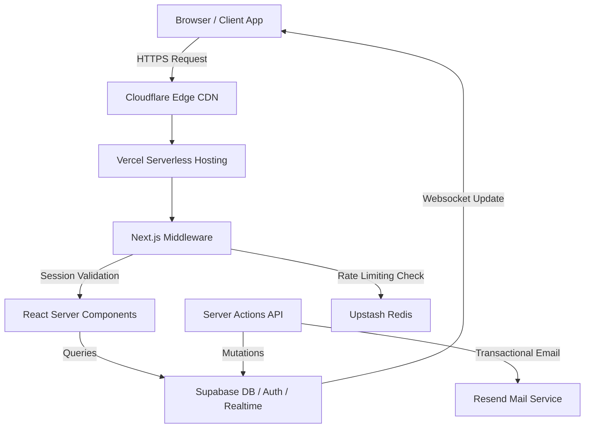

# Architecture Overview
> Elevique Client Portal · System Topology and Request Lifecycles

This document provides a high-level overview of the Elevique system topology, data routing, and the multi-layered security model.

---

## 1. System Topology

The platform integrates serverless hosting and database-as-a-service providers to scale with zero administrative overhead.

---

## 2. The Five Security Layers

Elevique employs a **layered security design** to achieve defense in depth. Compromising any single layer does not bypass system security:

1. **Cloudflare CDN Layer**:
   - Manages SSL certificate termination, DDoS mitigation, web application firewall rules, and bot traffic routing.
2. **Next.js Edge Middleware Layer**:
   - Intercepts requests immediately on Vercel's edge, validating cookies, executing path permissions, and invoking rate limits.
3. **Next.js Server Actions Layer**:
   - Receives API mutations, checks data boundaries using Zod, and validates user access roles via `requireRole()`.
4. **Supabase Database RLS Layer**:
   - Enforces RLS policies directly in PostgreSQL. Ensures database requests return only rows associated with the active user's permissions, even if a server action is bypassed.
5. **Upstash Redis Rate Limiting Layer**:
   - Restricts client requests per minute to block brute-force attempts and scraping scripts.

---

## 3. Core Request Lifecycle (Project Page Loading)

1. Client opens `/portal/projects/some-project-id`.
2. Cloudflare validates and routes request to Vercel.
3. Next.js Edge Middleware validates session cookies against Supabase Auth.
4. Middleware queries profile row: checks if `role = 'client'` and `is_active = true`.
5. Edge middleware allows route processing to proceed.
6. React Server Components query Supabase using the client session token.
7. Postgres RLS evaluates the check: `client_id = auth.uid()`.
   - **Access Granted**: Returns project details.
   - **Access Denied**: Returns empty set (no data leakage).
8. The server renders the page and sends it to the browser.
9. Browser client connects to Supabase Realtime channel to listen for live project updates.
